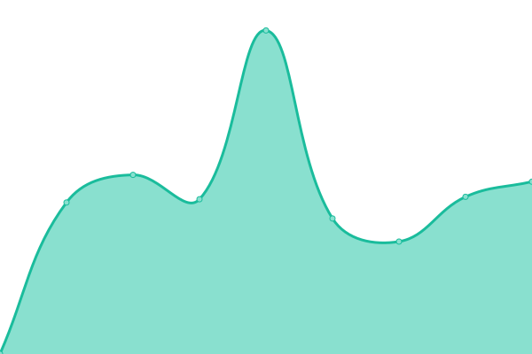
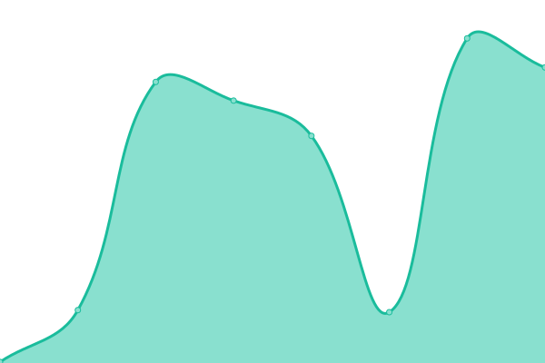
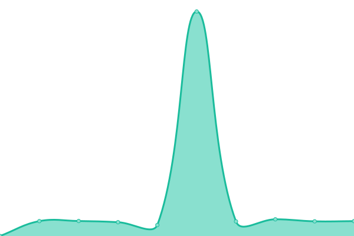

# [📈 Live Status](https://status.jacob9086.xyz): <!--live status--> **🟧 Partial outage**

This repository contains the open-source uptime monitor and status page for [Jacob](jacob9086.xyz), powered by [Upptime](https://github.com/upptime/upptime).

With [Upptime](https://upptime.js.org), you can get your own unlimited and free uptime monitor and status page, powered entirely by a GitHub repository. We use [Issues](https://github.com/jacobvd0/status.jacob9086.xyz/issues) as incident reports, [Actions](https://github.com/jacobvd0/status.jacob9086.xyz/actions) as uptime monitors, and [Pages](https://status.jacob9086.xyz) for the status page.

<!--start: status pages-->
<!-- This summary is generated by Upptime (https://github.com/upptime/upptime) -->
<!-- Do not edit this manually, your changes will be overwritten -->
<!-- prettier-ignore -->
| URL | Status | History | Response Time | Uptime |
| --- | ------ | ------- | ------------- | ------ |
|  [File Sharing - fileupload.zip](https://fileupload.zip) | 🟩 Up | [file-sharing-fileupload-zip.yml](https://github.com/jacobvd0/status.jacob9086.xyz/commits/HEAD/history/file-sharing-fileupload-zip.yml) | 

 210ms
     
 | 

<a href="https://status.jacob9086.xyz/history/file-sharing-fileupload-zip">100.00%</a>
    

|  [File Sharing - share.jacob9086.xyz](https://share.jacob9086.xyz) | 🟩 Up | [file-sharing-share-jacob9086-xyz.yml](https://github.com/jacobvd0/status.jacob9086.xyz/commits/HEAD/history/file-sharing-share-jacob9086-xyz.yml) | 

 128ms
     
 | 

<a href="https://status.jacob9086.xyz/history/file-sharing-share-jacob9086-xyz">100.00%</a>
    

|  [Main Site - jacob9086.xyz](https://jacob9086.xyz) | 🟩 Up | [main-site-jacob9086-xyz.yml](https://github.com/jacobvd0/status.jacob9086.xyz/commits/HEAD/history/main-site-jacob9086-xyz.yml) | 

 127ms
     
 | 

<a href="https://status.jacob9086.xyz/history/main-site-jacob9086-xyz">100.00%</a>
    

|  [Zipline - zipline.jacob9086.xyz](https://zipline.jacob9086.xyz) | 🟥 Down | [zipline-zipline-jacob9086-xyz.yml](https://github.com/jacobvd0/status.jacob9086.xyz/commits/HEAD/history/zipline-zipline-jacob9086-xyz.yml) | 

 93ms
     
 | 

<a href="https://status.jacob9086.xyz/history/zipline-zipline-jacob9086-xyz">0.00%</a>
    

|  [Legacy CDN - cdn.jacob9086.xyz](https://cdn.jacob9086.xyz) | 🟩 Up | [legacy-cdn-cdn-jacob9086-xyz.yml](https://github.com/jacobvd0/status.jacob9086.xyz/commits/HEAD/history/legacy-cdn-cdn-jacob9086-xyz.yml) | 

 241ms
     
 | 

<a href="https://status.jacob9086.xyz/history/legacy-cdn-cdn-jacob9086-xyz">100.00%</a>
    

|  [Pterodactyl - panel.jacob9086.xyz](https://panel.jacob9086.xyz) | 🟥 Down | [pterodactyl-panel-jacob9086-xyz.yml](https://github.com/jacobvd0/status.jacob9086.xyz/commits/HEAD/history/pterodactyl-panel-jacob9086-xyz.yml) | 

 685ms
     
 | 

<a href="https://status.jacob9086.xyz/history/pterodactyl-panel-jacob9086-xyz">100.00%</a>
    

<!--end: status pages-->

[**Visit our status website →**](https://status.jacob9086.xyz)

## 📄 License

- Powered by: [Upptime](https://github.com/upptime/upptime)
- Code: [MIT](./LICENSE) © [Jacob](jacob9086.xyz)
- Data in the `./history` directory: [Open Database License](https://opendatacommons.org/licenses/odbl/1-0/)
